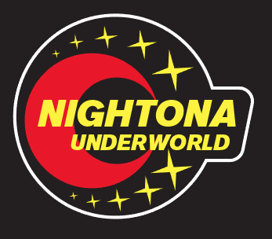
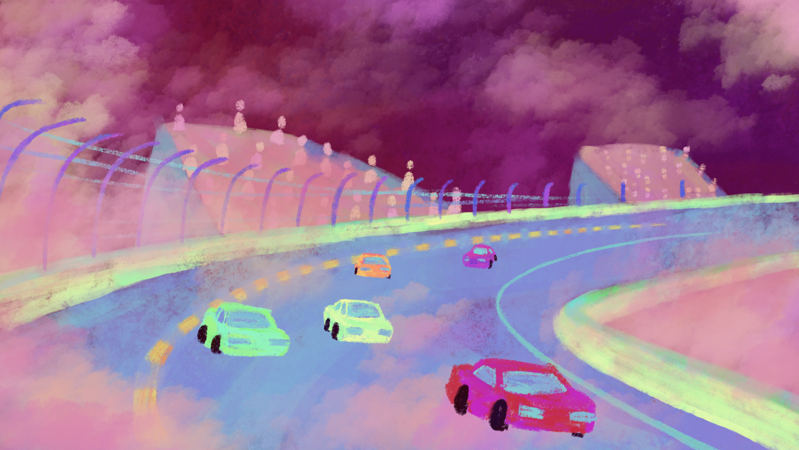

nightona5
==========
 

Videojuego de carreras donde debes de evitar choques tomando control del cuerpo de los pilotos en el gran Nightona 5trillion la pista de carreras más peligrosa del universo entero. Te esperan choques, mucha tensión y tsurus tuneados. Desarrollado para el Supersensory Megamix '21 del estudio de videojuegos Strangest.io

## Arte conceptual
 

## Licencia
Este programa es software gratuito: puedes redistribuirlo y / o modificarlo
bajo los términos de la Licencia Pública General GNU publicada por
la Free Software Foundation, ya sea la versión 3 de la Licencia, o
(a su elección) cualquier versión posterior.

Este programa se distribuye con la esperanza de que sea de utilidad,
pero SIN NINGUNA GARANTÍA; sin siquiera la garantía implícita de
COMERCIABILIDAD o APTITUD PARA UN PROPÓSITO PARTICULAR. Ver el
Licencia pública general GNU para más detalles.

Debería haber recibido una copia de la Licencia Pública General GNU
junto con este programa. De lo contrario, consulte <https://www.gnu.org/licenses/>.